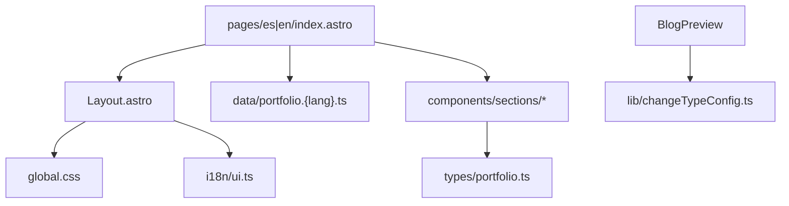

# Arquitectura del proyecto

## Estructura de carpetas

```text
/
├── public/
│   ├── favicon.svg
│   └── fonts/              # Fuentes locales (si aplica)
├── src/
│   ├── styles/
│   │   └── global.css      # Tailwind v4 + tokens @theme
│   ├── i18n/
│   │   ├── ui.ts           # Cadenas de UI por idioma
│   │   └── utils.ts        # getLangFromUrl, useTranslations
│   ├── types/
│   │   └── portfolio.ts    # Tipos compartidos ES/EN
│   ├── data/
│   │   ├── portfolio.es.ts # Contenido placeholder ES
│   │   └── portfolio.en.ts # Contenido placeholder EN
│   ├── lib/
│   │   └── changeTypeConfig.ts
│   ├── components/
│   │   ├── Header.astro
│   │   ├── ThemeToggle.astro
│   │   └── sections/
│   │       ├── Hero.astro
│   │       ├── About.astro
│   │       ├── Stack.astro
│   │       ├── Projects.astro
│   │       ├── Career.astro
│   │       ├── BlogPreview.astro
│   │       ├── Contact.astro
│   │       └── Footer.astro
│   ├── layouts/
│   │   └── Layout.astro
│   ├── pages/
│   │   ├── index.astro     # Redirect → /es
│   │   ├── es/
│   │   │   └── index.astro
│   │   └── en/
│   │       └── index.astro
│   └── content/            # Fase 2 — blog
│       ├── config.ts
│       └── blog/
│           ├── es/
│           └── en/
├── docs/                   # Documentación del proyecto
├── astro.config.mjs
└── biome.json
```

## Flujo de datos



## Capas

| Capa | Responsabilidad |
|------|-----------------|
| **pages/** | Composición de secciones por locale |
| **layouts/** | HTML shell, meta, tema, import CSS global |
| **components/sections/** | Presentación de cada sección del portafolio |
| **data/** | Contenido del portafolio por idioma |
| **i18n/** | Cadenas de interfaz (nav, labels, CTAs) |
| **types/** | Contratos TypeScript compartidos |
| **lib/** | Utilidades reutilizables (changeTypeConfig) |
| **styles/** | Design tokens y configuración Tailwind |

## Rutas

| Ruta | Descripción |
|------|-------------|
| `/` | Redirect a `/es` |
| `/es` | Homepage en español |
| `/en` | Homepage en inglés |
| `/es/blog` | Listado blog (Fase 2) |
| `/en/blog` | Listado blog (Fase 2) |

## Build

Sitio estático (SSG). Sin adaptador SSR en Fase 1. Output en `./dist/`.
